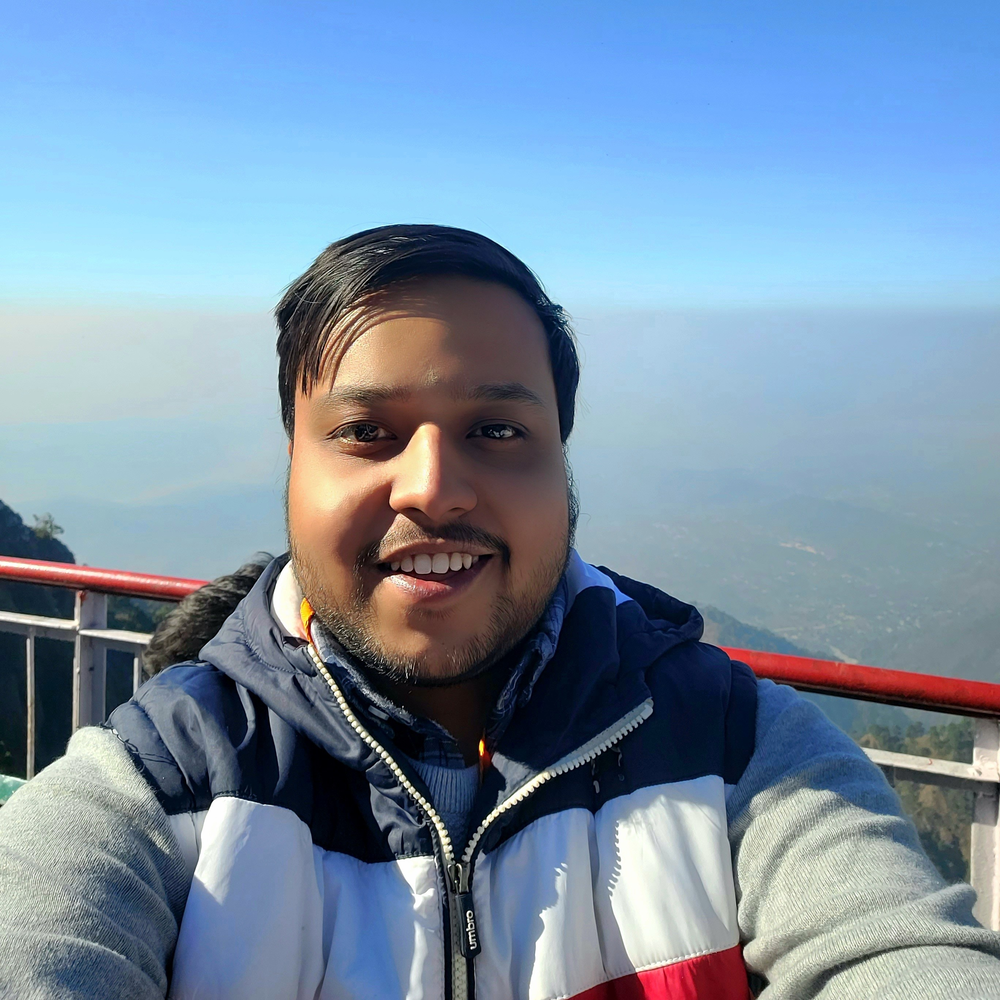

::: {.about-hero}
::: {.about-avatar}

:::

::: {.about-intro}

# Hi, I'm Utkarsh. {.about-name}

[Machine Learning Engineer @ Omdena · Cricket Analyst]{.about-role}

::: {.social-chips}

<a class="chip-link" href="https://github.com/Utkarsh736"><i class="bi bi-github"></i>GitHub</a>
<a class="chip-link" href="https://www.linkedin.com/in/utkarsh736/"><i class="bi bi-linkedin"></i>LinkedIn</a>
<a class="chip-link" href="https://twitter.com/Utkarsh736"><i class="bi bi-twitter-x"></i>Twitter</a>
<a class="chip-link" href="https://huggingface.co/Utkarsh736"><i class="bi bi-emoji-smile"></i>HuggingFace</a>
<a class="chip-link" href="https://www.kaggle.com/utkarshtomar736"><i class="bi bi-bar-chart-line"></i>Kaggle</a>
<a class="chip-link" href="https://bsky.app/profile/utkarsh736.bsky.social"><i class="bi bi-bluesky"></i>Bluesky</a>
<a class="chip-link" href="https://dagshub.com/Utkarsh736"><i class="bi bi-diagram-3"></i>DagsHub</a>

:::

:::

:::

## Bio

Hello! I'm a machine learning engineer and sports analyst with a focus on cricket. At [Omdena](https://omdena.com) I build and ship models for real business problems — from computer vision and object detection to tabular learning and ensemble methods. I care about the whole lifecycle: clean data pipelines, honest experiments, and models that survive contact with production.

I'm a polyglot programmer at heart. Python is home, with C, Golang, and Rust next on the bench — I enjoy learning how different languages think about the same problem. Away from the keyboard you'll find me following cricket, hockey, MMA, and the NFL, or exploring the world of movies. Sports are where my two worlds meet: data that moves, and stories that numbers can tell.

## Skills

::: {.chip-group}

::: {.chip-group-label}
Languages
:::

::: {.chips}
[Python]{.chip} [C]{.chip} [Golang]{.chip} [Rust]{.chip}
:::

:::

::: {.chip-group}

::: {.chip-group-label}
Machine Learning & Data
:::

::: {.chips}
[PyTorch]{.chip} [TensorFlow]{.chip} [Keras]{.chip} [scikit-learn]{.chip} [XGBoost]{.chip} [YOLOv5]{.chip} [Pandas]{.chip} [NumPy]{.chip} [Matplotlib]{.chip} [Seaborn]{.chip}
:::

:::

::: {.chip-group}

::: {.chip-group-label}
MLOps & Tooling
:::

::: {.chips}
[Git]{.chip} [DVC]{.chip} [MLflow]{.chip} [Tableau]{.chip} [Gradio]{.chip}
:::

:::

::: {.chip-group}

::: {.chip-group-label}
Domains
:::

::: {.chips}
[Computer Vision]{.chip} [Object Detection]{.chip} [Cricket Analytics]{.chip} [Video Analytics]{.chip} [Ensemble Modeling]{.chip}
:::

:::

## Experience

::: {.timeline}

::: {.timeline-item}

[Machine Learning Engineer — Omdena]{.timeline-role}

[Omdena]{.timeline-org}
[May 2022 — Present]{.timeline-dates}

- Developed and deployed machine learning models — Random Forest, XGBoost, and deep learning architectures like YOLOv5 and YOLT — across diverse business applications.
- Implemented computer vision neural networks for object detection, strengthening image-processing pipelines end to end.
- Engineered data pipelines with Python, Pandas, and NumPy to process large datasets and surface actionable insights.
- Built and optimized neural architectures with PyTorch, TensorFlow, and Keras; applied ensemble techniques to push model performance further.
- Established model versioning and experiment tracking with Git, DVC, and MLflow, and visualized results with Matplotlib and Seaborn for stakeholders.
- Partnered with cross-functional teams to propose and implement AI-driven solutions to business challenges.

:::

::: {.timeline-item}

[Cricket Video Analyst — Mad About Sports]{.timeline-role}

[Mad About Sports · Intern]{.timeline-org}
[Video & Performance Analytics]{.timeline-dates}

- Conducted in-depth analysis of batsmen and bowlers using video analytics and data visualization, identifying strengths, weaknesses, and strategic matchups.
- Processed and visualized complex cricket performance data with the Python ecosystem and Tableau.
- Developed and presented data-driven recommendations that contributed to improved player performance and team strategy.
- Applied machine learning to predict player performance trends and inform training regimens.
- Collaborated with analysts and coaches to produce high-quality analytical reports and presentations.

:::

:::

## Off the clock

::: {.chips}
[Cricket]{.chip} [Hockey]{.chip} [MMA]{.chip} [NFL]{.chip} [Movies]{.chip}
:::

::: {.cta-card}

[Get in touch]{.cta-title}

The fastest way to reach me is [LinkedIn](https://www.linkedin.com/in/utkarsh736/) — or say hi on any platform below. Always happy to talk machine learning, cricket analytics, or trade movie recommendations.

::: {.social-chips}

<a class="chip-link" href="https://github.com/Utkarsh736"><i class="bi bi-github"></i>GitHub</a>
<a class="chip-link" href="https://www.linkedin.com/in/utkarsh736/"><i class="bi bi-linkedin"></i>LinkedIn</a>
<a class="chip-link" href="https://twitter.com/Utkarsh736"><i class="bi bi-twitter-x"></i>Twitter</a>
<a class="chip-link" href="https://huggingface.co/Utkarsh736"><i class="bi bi-emoji-smile"></i>HuggingFace</a>
<a class="chip-link" href="https://bsky.app/profile/utkarsh736.bsky.social"><i class="bi bi-bluesky"></i>Bluesky</a>

:::

[<i class="bi bi-file-earmark-person"></i> Download resume](assets/Resources/resume.pdf){.btn .btn-outline-secondary}
:::
